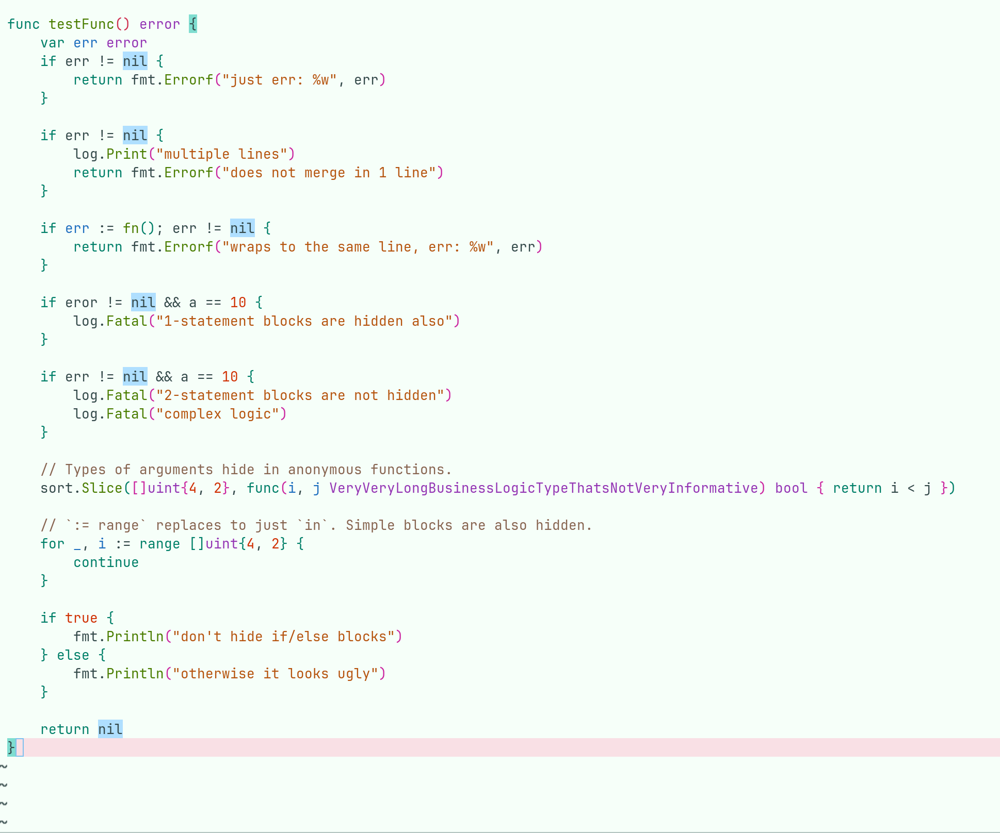
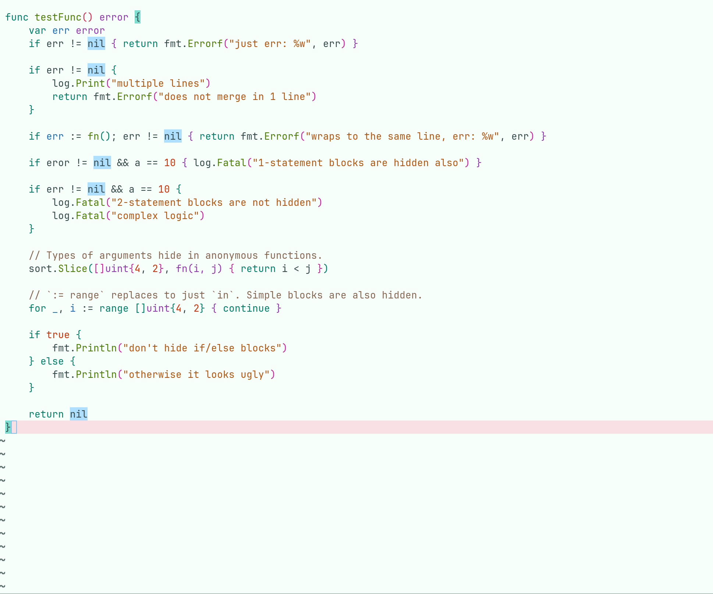

# `go-prettify-mode.el`
It is a minor mode for Emacs that replaces several Go statements, e.g. `if err != nil`, blocks with 1 code, `range` statement and hide types in anonymous functions. All these make a code shorter and more informative using overlays.

__Before:__



__After:__



Almost twice shorter!

## Customization
To turn hiding features customize `go-prettify-feature-list` variable, for example to enable everything:
```emacs-lisp
(setq go-prettify-feature-list
 '(lambda-func
   range
   if-err-nil
   1-code-block))
```

To turn the mode on in every Go buffer, add a hook:

``` emacs-lisp
(add-hook 'go-mode-hook '(lambda () (go-prettify-mode 1)))
```

To toggle it via a hotkey add this code:

``` emacs-lisp
(define-key go-mode-map (kbd \"C-c C-e\") #'go-prettify-mode)
```

You can customize a face for overlays via customization options or just setting variables `go-prettify-face`.

How the configuration is looked in my `init.el` with `use-package`:
``` emacs-lisp
(use-package go-prettify
  :after (go-mode)
  :config
  (define-key go-mode-map (kbd "C-c C-e") #'go-prettify-mode))

(use-package go-mode
  :hook
  (go-mode . (lambda () (go-prettify-mode 1))))
```

Or, in spacemacs:
```emacs-lisp
dotspacemacs-additional-packages
   '(go-prettify-mode)
...
;; in dotspacemacs/user-config:
  (with-eval-after-load 'go-mode
    (add-hook 'go-mode-hook 'go-prettify-mode)
    (define-key go-mode-map (kbd "C-c C-e") #'go-prettify-mode))
```

## TODO
- [x] change regexps to rx elisp package
- [x] change regexps to their own functions that return start point
- [x] make its own namespace (go-prettify)
- [x] codeberg
- [x] fix 2 cases in test.go
  - [x] if/else
  - [x] method func
- [x] MELPA
- [x] test case with structs
- [x] change : to { } like in Goland
  - [x] that should be done with 2 overlays that hide new lines, so the syntax is still highlighted
- [ ] hide new line before if err != nil
- [ ] optionally hide return statement and other things
- [x] 2 lines are also hidden bug
- [ ] commenting out doesn't work well (should be added a webhook that turns off and then turns on the feature)
- [ ] sometimes it fails to load go-mode with this thing, need to be debugged
- [x] refresh picture
- [x] refresh readme

## Things to check before commit
- melpazoid
```bash
cd <melpazoid-repo>
RECIPE='(go-prettify-mode :fetcher codeberg :repo "snyssfx/go-prettify-mode.")' \
    LOCAL_REPO='~/go-prettify-mode.el' make
python3 melpazoid/melpazoid.py
```
- byte-compilation
- checkdoc
- package-lint
